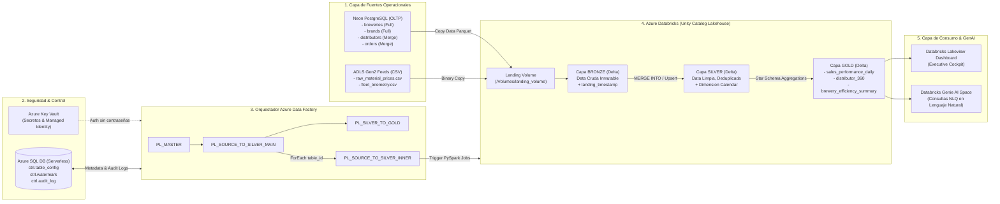

# 🍺 BrewOps Platform — Arquitectura y Especificación Técnica para Draw.io / Excalidraw

Este documento contiene la estructura visual completa, cajas, conexiones y texto exacto para diagramar en **Draw.io** o **Excalidraw**.

---

## 1. Código Mermaid (Importable directamente en Draw.io: Arrange -> Insert -> Advanced -> Mermaid)

---

## 2. Mapa de Bloques para Diagramar a Mano (Excalidraw / Draw.io)

### Bloque A (Izquierda - Fuentes):
* **Caja Azul 1:** `Neon PostgreSQL` (Logo de Postgres). Texto: *"Base Transaccional OLTP"*.
* **Caja Azul 2:** `Blob / ADLS Gen2` (Logo de Azure Storage). Texto: *"Feeds externos CSV de socios"*.

### Bloque B (Arriba Centro - Gobierno y Seguridad):
* **Caja Amarilla:** `Azure Key Vault`. Texto: *"Managed Identity (RBAC) - Cero secretos en código"*.
* **Caja Morada:** `Azure SQL Database`. Texto: *"Metadata Engine: table_config, watermark, audit_log"*.

### Bloque C (Centro - Orquestación):
* **Caja Azul Cielo:** `Azure Data Factory`. 
  * Flecha interna: `PL_MASTER` $\rightarrow$ `PL_SOURCE_TO_SILVER` $\rightarrow$ `PL_SILVER_TO_GOLD`.

### Bloque D (Derecha Centro - El Lakehouse):
* **Gran Caja Roja/Naranja:** `Azure Databricks + Unity Catalog`.
  * Dentro, 3 niveles verticales:
    1. **Bronze (Cobre):** Archivos Parquet crudos + timestamp.
    2. **Silver (Plata):** Tablas Delta con MERGE INTO (Upsert) + `silver.calendar`.
    3. **Gold (Oro):** Modelos analíticos preagregados.

### Bloque E (Extrema Derecha - Consumo):
* **Caja Verde:** `Lakeview Dashboard` + `Genie AI Agent`. Texto: *"BI Ejecutivo & Asistente Conversacional"*.
