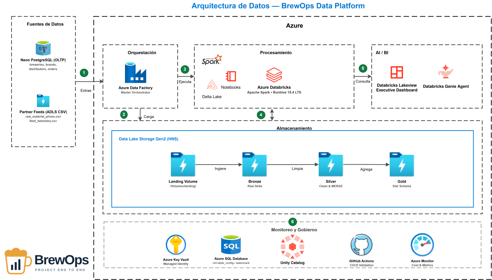

# 🍺 BrewOps Data Platform — End-to-End Enterprise Lakehouse Architecture

> **Plataforma de datos empresarial e híbrida para la industria cervecera y de consumo masivo (FMCG).**  
> Diseñada bajo arquitectura Medallion en Azure Databricks con Unity Catalog, orquestación metadata-driven en Azure Data Factory, almacenamiento seguro en ADLS Gen2 y gobierno centralizado con Azure Key Vault.

---

## 🏛️ 1. Arquitectura de Datos Oficial (Azure & Databricks Architecture)

Diagrama técnico oficial estructurado según los estándares de diseño del **Microsoft Azure Architecture Center**:

---

## 🎨 2. Infografía de Flujo de Datos (Data Pipeline Overview)

Flujo secuencial de extremo a extremo que ilustra el recorrido de los datos, las tablas de control y las capas Medallion:

---

## 📸 3. Evidencias de Ejecución & Capa de Analítica

### A. Databricks Lakeview Dashboard (Executive Cockpit)
Visualización ejecutiva con KPIs principales ($120.54K USD de ingresos, 36.44K litros), desglose por categoría de cerveza, mezcla de empaques (retornable vs lata), utilización de plantas cerveceras y matriz de riesgo crediticio de distribuidores:

### B. Databricks Genie AI Space (Consultas en Lenguaje Natural)
Interacción con el modelo semántico en lenguaje natural respondiendo preguntas complejas de márgenes y ventas sin escribir código SQL:

### C. Pipeline Orquestador Maestro en Azure Data Factory
Orquestación parametrizada de extremo a extremo (Source $\rightarrow$ Landing $\rightarrow$ Bronze $\rightarrow$ Silver $\rightarrow$ Gold) validada al 100% en verde con auditoría de ejecución:

---

## 🚀 4. Stack Tecnológico & Componentes Cloud

| Componente | Servicio Azure / Cloud | Rol en la Arquitectura |
| :--- | :--- | :--- |
| **Fuentes Operacionales** | Neon PostgreSQL (Serverless) & ADLS Gen2 | Simulación de transacciones de ventas y feeds externos de materias primas. |
| **Landing & Storage** | Azure Data Lake Storage Gen2 (HNS) | Jerarquía POSIX en contenedor `landing` y almacenamiento de tablas Delta Lake. |
| **Control de Acceso** | Azure Key Vault & Managed Identities | Gestión centralizada de secretos sin credenciales en texto plano (Zero-Trust). |
| **Motor de Metadatos** | Azure SQL Database (Serverless) | Gobernanza de pipelines mediante tablas `table_config`, `watermark` y `audit_log`. |
| **Orquestación** | Azure Data Factory (ADF V2) | Pipelines dinámicos y parametrizados para cargas FULL e INCREMENTALES (Watermark). |
| **Procesamiento** | Azure Databricks (Runtime 15.4 LTS) | Motor PySpark con Delta Lake para transformaciones Medallion (Landing $\rightarrow$ Bronze $\rightarrow$ Silver $\rightarrow$ Gold). |
| **Gobernanza** | Unity Catalog & Storage Volumes | Catálogo unificado, control de esquemas y volúmenes externos sin mounts antiguos. |
| **Consumo & BI** | Lakeview Dashboards & Genie AI | Analítica visual de autoservicio y consultas conversacionales NLQ. |
| **CI/CD** | GitHub Actions | Validación automática de sintaxis PySpark, esquemas JSON de ADF y scripts DDL. |

---

## 📊 5. Modelo de Datos Medallion

### Capa Bronze (Raw / Inmutable)
* `bronze.breweries`, `bronze.brands`, `bronze.distributors`, `bronze.orders`.
* Conserva la historia completa de extracciones con marcas de tiempo `landing_timestamp` e `insert_timestamp`.

### Capa Silver (Enriquecida & MERGE)
* Aplicación de **Delta Upserts (`MERGE INTO`)** usando claves de negocio (`distributor_id`, `order_id`).
* Deduplicación, limpieza de datos y tipado estricto.
* Dimensión temporal `silver.calendar` generada dinámicamente (2020–2030).

### Capa Gold (Métricas & KPIs Ejecutivos)
1. **`gold.sales_performance_daily`:** Ingresos brutos, cajas vendidas, litros despachados e ingreso promedio por litro por región y planta cervecera.
2. **`gold.distributor_360`:** Volumen histórico de compras, recurrencia de pedidos y porcentaje de utilización de línea de crédito.
3. **`gold.brewery_efficiency_summary`:** Volumen despachado en Hectolitros (hl) comparado contra la capacidad mensual instalada de cada cervecería.

---

## 🛠️ 6. Automatización & CI/CD con GitHub Actions

El repositorio cuenta con un pipeline automatizado (`.github/workflows/ci_cd.yml`) que se ejecuta en cada `push` o `pull_request` a la rama `main`:
1. **Linting de Notebooks:** Verificación estricta de código Python/PySpark mediante `ruff`.
2. **Validación de JSON de ADF:** Comprobación sintáctica de definiciones declarativas de pipelines antes del despliegue.
3. **Chequeo de Integridad SQL:** Validación de dependencias y scripts DDL para esquemas de Postgres y Azure SQL.
